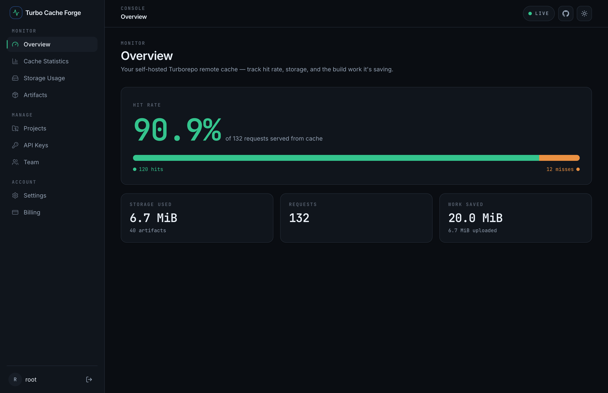

<div align="center">


# Turbo Cache Forge

**A self-hosted [Turborepo](https://turborepo.com) remote cache you own end to end.**
Speak the Turbo **v8** protocol, store artifacts on your own disk or S3, and watch every
cache hit in a live dashboard — no Vercel account, no per-seat bill.

[](https://github.com/nasraldin/turbo-cache-forge/actions/workflows/ci.yml)
[](https://nasraldin.github.io/turbo-cache-forge/)
[](https://hub.docker.com/r/nasraldin/turbo-cache-forge-api)
[](LICENSE)
[](https://go.dev)

📖 **[Read the docs](https://nasraldin.github.io/turbo-cache-forge/)** · 🚀 **[Quickstart](https://nasraldin.github.io/turbo-cache-forge/getting-started/quickstart/)** · 🏗 **[Architecture](https://nasraldin.github.io/turbo-cache-forge/reference/architecture/)**



</div>

---

## What is it?

Turborepo caches each task's output keyed by a hash of its inputs. A **remote cache**
shares those outputs across machines, so CI and teammates download results instead of
rebuilding them — minutes become seconds. The hosted option needs a cloud account and
bills per seat. **Turbo Cache Forge is the same capability, self-hosted:** your
artifacts never leave your infrastructure.

It's four surfaces around one Go server:

| Surface | What it is | Talks to it |
|---|---|---|
| **Cache API** | Turbo v8 protocol (`/v8/artifacts/*`), hashed-bearer auth | the `turbo` CLI |
| **Management API** | `/api/v1` — tokens, projects, stats, artifacts | dashboard & CLI |
| **Dashboard** | Next.js console — hit rate, trends, artifact browser | humans |
| **CLI** | `turbo-cache` — login, token/project, stats, doctor | operators |

Metadata lives in **Postgres**; artifact blobs go to the **filesystem or any
S3-compatible store** (AWS S3, Cloudflare R2, MinIO).

## Quickstart

```bash
git clone https://github.com/nasraldin/turbo-cache-forge.git
cd turbo-cache-forge
docker compose -f infra/docker/docker-compose.yml up -d --build
```

This starts Postgres, applies migrations, and runs the cache API (`:8080`) and the
dashboard (`:3000`). The default config uses **built-in auth** — sign in at
**http://localhost:3000** with `root` / `root`, then create a cache token under
**API Keys**.

Point Turborepo at it:

```bash
export TURBO_API=http://localhost:8080
export TURBO_TOKEN=<your-token>
export TURBO_TEAM=root
turbo run build --remote-only     # run twice: MISS, then HIT
```

Or exercise the protocol directly:

```bash
curl -s -H "Authorization: Bearer $TURBO_TOKEN" \
  "http://localhost:8080/v8/artifacts/status"          # {"status":"enabled"}
```

Full walkthrough → **[Quickstart](https://nasraldin.github.io/turbo-cache-forge/getting-started/quickstart/)**.
Prefer prebuilt images? Pull `nasraldin/turbo-cache-forge-{api,migrate,dashboard}` from Docker Hub.

## Features

- **Drop-in Turbo v8** — point `TURBO_API` at your server; the CLI just works.
- **Your storage** — filesystem by default, or S3/R2/MinIO via one env var.
- **Live dashboard** — hit rate, daily trend chart, projects, tokens, artifact browser.
- **Two auth worlds, separated** — hashed cache tokens vs. built-in/OIDC human sign-in.
- **Runs anywhere** — one `docker compose up`; distroless, non-root API image.
- **Observability** — Prometheus metrics always on; OpenTelemetry tracing and Sentry
  opt-in, inert until configured.

## Documentation

The full docs live at **[nasraldin.github.io/turbo-cache-forge](https://nasraldin.github.io/turbo-cache-forge/)**:

- [What is it?](https://nasraldin.github.io/turbo-cache-forge/getting-started/what-is-it/) · [Configuration](https://nasraldin.github.io/turbo-cache-forge/getting-started/configuration/)
- Guides: [Connect Turborepo](https://nasraldin.github.io/turbo-cache-forge/guides/connect-turborepo/) · [Authentication](https://nasraldin.github.io/turbo-cache-forge/guides/authentication/) · [Storage backends](https://nasraldin.github.io/turbo-cache-forge/guides/storage-backends/) · [Dashboard](https://nasraldin.github.io/turbo-cache-forge/guides/dashboard/) · [CLI](https://nasraldin.github.io/turbo-cache-forge/guides/cli/)
- Reference: [Cache API](https://nasraldin.github.io/turbo-cache-forge/reference/cache-api/) · [Management API](https://nasraldin.github.io/turbo-cache-forge/reference/management-api/) · [Environment](https://nasraldin.github.io/turbo-cache-forge/reference/environment/) · [Architecture](https://nasraldin.github.io/turbo-cache-forge/reference/architecture/)

## Repository layout

```
services/api/       Go cache + management API (own module)
services/cli/       turbo-cache CLI (own module)
apps/dashboard/     Next.js 15 dashboard
apps/docs/          This documentation site (Astro Starlight)
packages/           Shared TS types + /api/v1 client
infra/docker/       Dockerfile (multi-target) + docker-compose
infra/migrations/   goose SQL migrations
```

It's two decoupled build worlds — **Go modules** and a **pnpm + Turborepo** workspace —
that communicate only over HTTP. See [Architecture](https://nasraldin.github.io/turbo-cache-forge/reference/architecture/).

## Contributing

Contributions welcome — see the [Contributing guide](https://nasraldin.github.io/turbo-cache-forge/project/contributing/).
Every PR runs Go + JS tests via [CI](.github/workflows/ci.yml); merges to `main` publish
Docker images and auto-deploy these docs.

## Status

All five planned phases are complete and merged. See the
[Roadmap](https://nasraldin.github.io/turbo-cache-forge/project/roadmap/) and
[`docs/HANDOFF.md`](docs/HANDOFF.md).

## License

See [LICENSE](LICENSE).
