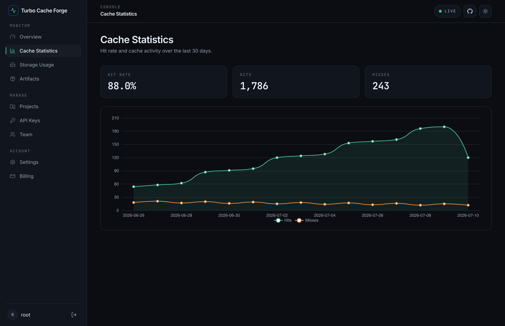
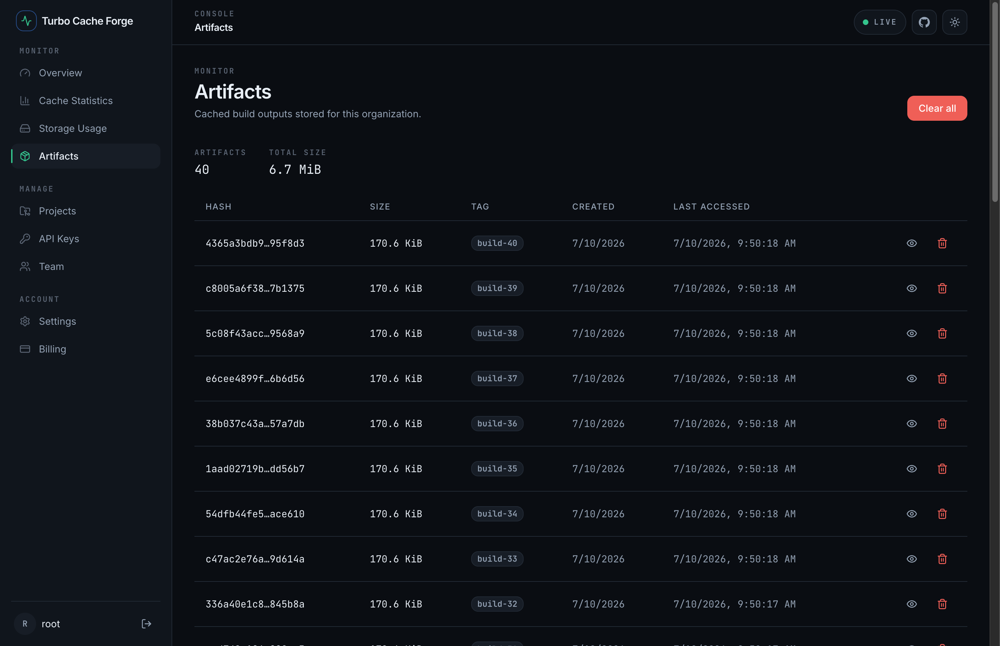
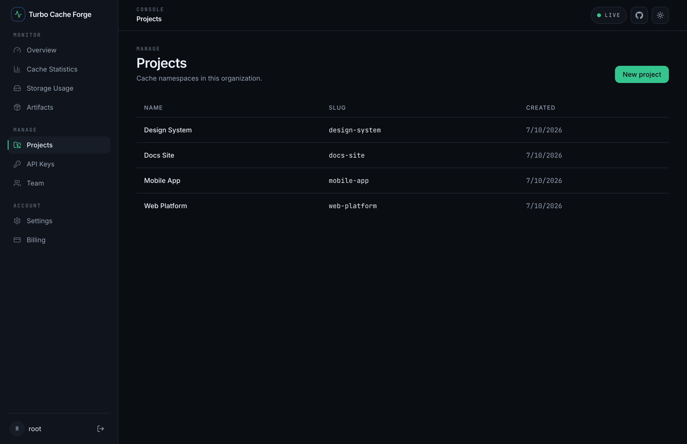
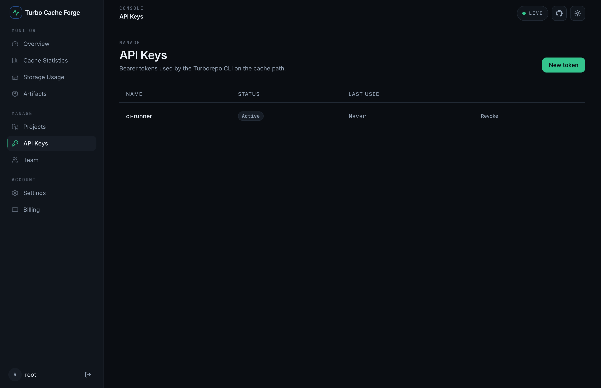
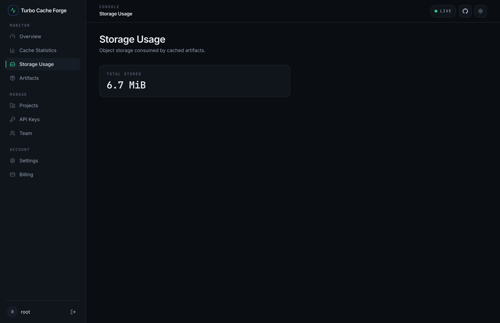

The dashboard is a Next.js console that talks **only** to the management API
(`/api/v1`) — never to storage, the database, or the cache path directly. It reads
your live data and renders it. Sign in at **http://localhost:3000** (built-in mode:
`root` / `root` by default).

## Overview

The landing screen: cache **hit rate**, storage used, total requests, and the build
work saved (bytes that would have been recomputed without the cache).

## Cache Statistics

Hit rate and cache activity over time. The trend chart plots daily hits and misses so
you can watch the cache warm up as more of your builds get shared.

## Artifacts

Browse every cached artifact — hash, size, tag, and when it was created and last
accessed. You can view an artifact's detail, download it, delete one, or clear them
all.

## Projects

Projects are **cache namespaces** within an organization. Create one per app or
package in your monorepo to keep artifacts organized.

## API Keys

Mint and revoke the **bearer tokens** the Turborepo CLI uses on the cache path. The
plaintext token is shown **once** at creation — copy it then; only its hash is stored.

## Storage Usage

The total object storage consumed by cached artifacts, so you can keep an eye on
growth and set retention accordingly.

## A note on live data

In built-in mode the management API is mounted and the dashboard shows live data out of
the box. In OIDC mode, `/api/v1` mounts only when `OIDC_ISSUER` is set — until then the
data panels show their (safe) empty/error states by design. See
[Authentication](/turbo-cache-forge/guides/authentication/).
